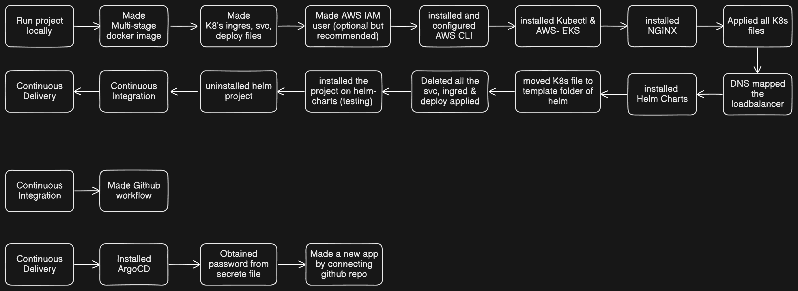

# DevOpsify the .NET Resume Web Application

The main goal of this project is to implement DevOps practices in a .NET Resume web application.  
The project is a simple website written in **.NET Core** that serves dynamic HTTP requests.

DevOps practices include the following:

- Creating Dockerfile (Multi-stage build)
- Containerization
- Continuous Integration (CI)
- Continuous Deployment (CD)

---

## 📊 Summary Diagram

*(Diagram to be updated for .NET version if needed)*

---

## 🐳 Creating Dockerfile (Multi-stage build)

The **Dockerfile** is used to build a Docker image that contains the .NET web application and its dependencies.  
We use a **multi-stage build** to reduce the size of the final image and improve security by removing unnecessary files.

Example Dockerfile:

```dockerfile
# Build stage
FROM mcr.microsoft.com/dotnet/sdk:8.0 AS build
WORKDIR /src
COPY . .
RUN dotnet restore
RUN dotnet publish -c Release -o /app

# Runtime stage
FROM mcr.microsoft.com/dotnet/aspnet:8.0 AS runtime
WORKDIR /app
COPY --from=build /app .
ENTRYPOINT ["dotnet", "ResumeWebApp.dll"]


## 📦 Containerization

Containerization is the process of packaging the application and its dependencies into a container.
We use Docker to containerize the .NET Resume WebApp.

Commands to build the Docker container: 
```bash
docker build -t <your-docker-username>/resume-webapp .
```

Command to run the Docker container:
```bash
docker run -p 8080:8080 <your-docker-username>/resume-webapp
```

Command to push the Docker container to Docker Hub:
```bash
docker push <your-docker-username>/resume-webapp
```

## 🔄 Continuous Integration (CI)

Continuous Integration (CI) is the practice of automating the integration of code changes into a shared repository.
We use GitHub Actions to build, test, and validate code for the .NET Resume WebApp.

The CI pipeline includes:

✅ Checking out the code
✅ Restoring dependencies
✅ Building the solution
✅ Running unit tests
✅ Running code-quality checks using dotnet format

## 🚀 Continuous Deployment (CD)

Continuous Deployment (CD) is the practice of automatically deploying code changes to a target environment.

We use:
Docker Hub → To store our built images
Helm → To manage Kubernetes manifests
Argo CD → To automatically sync and deploy the app to Kubernetes
Argo CD setup ensures that:
The deployed app version matches the Git repo state
Any image updates (new tags) automatically update the app in Kubernetes


## 🎯 Conclusion

By applying DevOps practices:
The .NET Resume WebApp is fully containerized
CI/CD automation is implemented with GitHub Actions
Deployment is handled via Helm + Argo CD on Kubernetes
The pipeline ensures reliability, repeatability, and faster delivery
